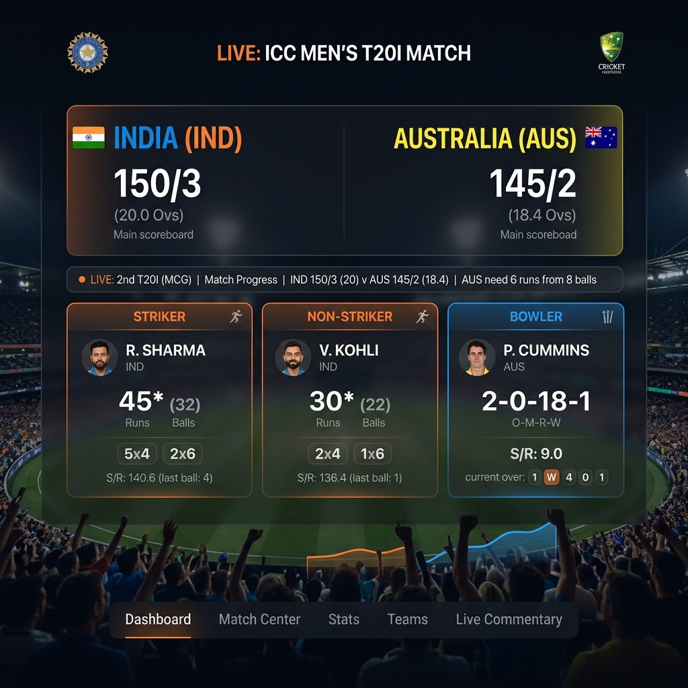
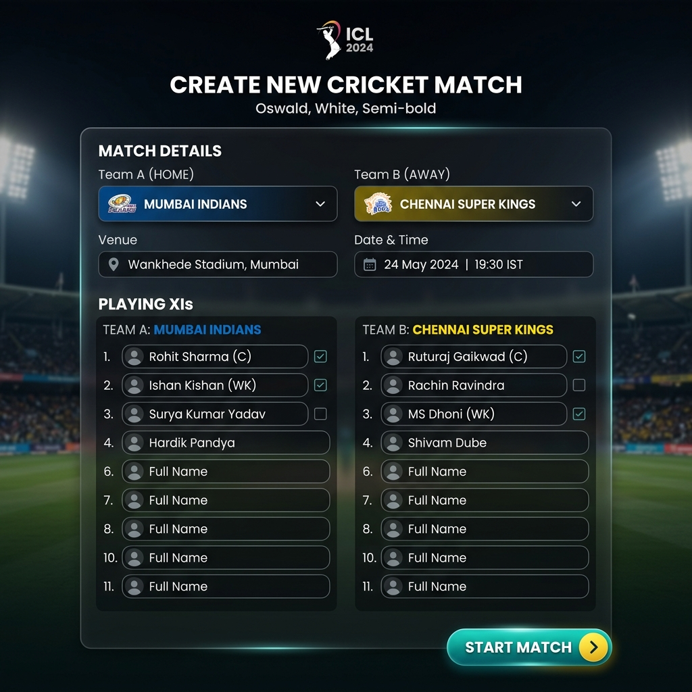

# Cricket Scoreboard Application - Professional Documentation

Welcome to the comprehensive documentation for the **Cricket Scoreboard Application**. This project is a full-stack web application designed for tracking live cricket matches, featuring a highly responsive user interface and a robust backend.

---

## 🎨 Application Overview & User Interface

The application is built with a modern aesthetic, ensuring that the match data is easily readable and visually appealing. Below are illustrative representations of the core interfaces.

### Live Match Dashboard
The dashboard provides a real-time overview of the match status, including runs, wickets, overs, and detailed stats for the Striker, Non-striker, and Bowler.


*Figure 1: Illustrative mockup of the Live Match Dashboard.*

### Match Initialization
Administrators and scorers can easily initiate a new match by selecting teams, assigning players, and setting the match status through an intuitive form.


*Figure 2: Illustrative mockup of the Match Setup interface.*

---

## 🏗️ Architecture & Tech Stack

This project follows a decoupled client-server architecture:

1. **Backend (API Layer)**
   - **Framework:** Django & Django REST Framework (DRF)
   - **Database:** SQLite (default, easily swappable to PostgreSQL)
   - **Role:** Manages the relational data (Teams, Players, Matches), handles business logic, and exposes JSON endpoints.

2. **Frontend (Presentation Layer)**
   - **Framework:** React.js powered by Vite
   - **UI Library:** Mantine Core & Custom CSS (Tailwind compatible)
   - **Role:** Fetches data asynchronously, resolves team flags via `flag-icons`, and renders the dynamic live dashboard.

---

## 📂 Project Structure

```text
CRICKET-SCOREBOARD/
│
├── backend/                       # Django Backend Directory
│   ├── scores/                    # Core Django App
│   │   ├── models.py              # Database Schema (Team, Player, Match)
│   │   ├── serializers.py         # DRF Data Serialization
│   │   ├── views.py               # API ViewSets & Routing
│   │   └── admin.py               # Django Admin Configuration
│   ├── manage.py                  # Django Management Script
│   └── db.sqlite3                 # Local Database
│
├── frontend/                      # React Frontend Directory
│   ├── src/
│   │   ├── App.jsx                # Main React Component & Routing
│   │   ├── data/
│   │   │   └── teams.js           # Static Mapping for Teams & Flags
│   │   └── app.css                # Global Styling & Mantine Overrides
│   ├── package.json               # Node Dependencies
│   └── vite.config.js             # Vite Build Configuration
│
└── start_cricket.bat              # Auto-starter script for Windows
```

---

## ⚙️ Core Models & Data Structure

The backend relies on three primary entities:

### 1. `Team` Model
Stores international team data. Linked directly to the frontend's static mapping to resolve standard ISO country flags.

### 2. `Player` Model
Represents individual cricketers with a `ForeignKey` to the `Team` model.

### 3. `Match` Model
The central entity for the scoreboard. Key fields include:
- **Teams:** `team_a`, `team_b`
- **Scores:** `runs_team_a`, `wickets_team_a`, `overs_team_a`, etc.
- **Current Action:**
  - `striker_name`, `striker_runs`, `striker_balls`
  - `non_striker_name`, `non_striker_runs`, `non_striker_balls`
  - `bowler_name`, `bowler_overs`, `bowler_runs`, `bowler_wickets`
- **Status:** `STATUS_CHOICES` (Upcoming, Live, Finished)

---

## 🚀 Installation & Running the Application

For a quick start on Windows, you can simply run the provided `start_cricket.bat` script, which launches both the frontend and backend servers automatically.

### Manual Setup (Backend)
1. **Navigate to backend and activate virtual environment:**
   ```bash
   cd cricket-scoreboard
   venv\Scripts\activate
   ```
2. **Install dependencies:**
   ```bash
   pip install -r requirements.txt
   ```
3. **Run Migrations & Start Server:**
   ```bash
   python manage.py migrate
   python manage.py runserver
   ```
   *The backend API will run on `http://localhost:8000/api/matches/`*

### Manual Setup (Frontend)
1. **Navigate to the frontend directory:**
   ```bash
   cd cricket-scoreboard/frontend
   ```
2. **Install dependencies:**
   ```bash
   npm install
   ```
3. **Start the Development Server:**
   ```bash
   npm run dev
   ```
   *The frontend will run on `http://localhost:5173/`*

---

## 📡 API Endpoints Reference

The Django REST Framework exposes the following RESTful endpoints:

- `GET /api/teams/` - List all teams.
- `GET /api/players/` - List all players.
- `GET /api/matches/` - List all matches.
- `POST /api/matches/` - Create a new match instance.
- `PUT/PATCH /api/matches/{id}/` - Update live match data (e.g., ball-by-ball updates).

### Sample Match Response Payload
```json
{
  "id": 1,
  "team_a": 1,
  "team_b": 2,
  "team_a_name": "India",
  "team_b_name": "Australia",
  "runs_team_a": 150,
  "wickets_team_a": 3,
  "overs_team_a": "18.2",
  "striker_name": "Rohit Sharma",
  "striker_runs": 45,
  "striker_balls": 32,
  "bowler_name": "Starc",
  "bowler_overs": "3.0",
  "bowler_runs": 22,
  "bowler_wickets": 1,
  "status": "LIVE"
}
```

---

## 💡 Customization & Extending
- **Adding New Teams:** Open the Django shell and create new `Team` objects, then update `frontend/src/data/teams.js` with the corresponding ISO country code for the flag icon.
- **Styling:** The frontend uses Mantine combined with custom CSS. You can modify `app.css` or update the Mantine `ThemeProvider` in `App.jsx` to tweak colors and typography.
